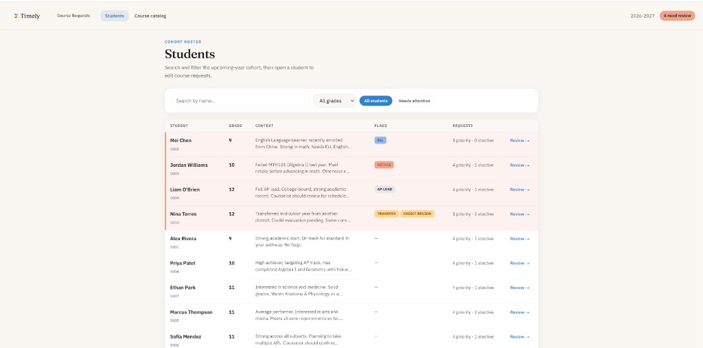

# Course Request Management

A working prototype for school counselors and assistant principals to view a student cohort and manage per-student course requests (priority vs elective) for the upcoming school year.

Built as a take-home exercise for Timely.



## Contents

- [Deliverables](#deliverables)
- [Quick start](#quick-start)
- [What the prototype covers](#what-the-prototype-covers)
- [Using the app](#using-the-app)
- [Architecture](#architecture)
- [Key design decisions](#key-design-decisions)
- [Assumptions & open questions](#assumptions--open-questions)
- [Written extensions](#written-extensions)
- [Testing approach](#testing-approach)
- [Pilot → scale](#pilot--scale)
- [Seed data notes](#seed-data-notes)

## Deliverables

| Deliverable | Location |
|-------------|----------|
| Working prototype (localhost) | [Quick start](#quick-start) → http://localhost:3000 |
| Source code | This repository |
| README: how to run, architecture, written extensions | This file |

**Stack:** Next.js 16 (App Router), TypeScript, in-memory API seeded from JSON, Vitest + Playwright.

## Quick start

```bash
npm install
npm run dev
```

Open [http://localhost:3000](http://localhost:3000) (redirects to `/students`).

Request edits persist across page refresh via an in-memory server store. Restarting the dev server resets data to seed values.

**Full CI gate locally:** `npm run test:ci` (lint → build → coverage → e2e)

## What the prototype covers

Mapped to the assignment problem statement:

| Requirement | Implementation |
|-------------|----------------|
| View a list of students for an upcoming school year | [`/students`](http://localhost:3000/students) — paginated roster with grade, profile context, flags, and request counts |
| Select a student and view or edit their requests | [`/students/[id]`](http://localhost:3000/students/S001) — student workspace with priority / elective columns |
| Assign requests from the catalog (priority or elective) | Add-course sheet from catalog search; move courses between lists; remove requests |
| Clear summary of each student's request list | Two-column layout (Priority \| Elective) plus profile, flags, and contextual banners |

Appendix B edge cases (S002 ELL, S003 retake, S009 full AP load, S010 transfer) have roster flags and in-workspace banners. See [seed data notes](#seed-data-notes).

## Using the app

| Route | Purpose |
|-------|---------|
| `/students` | Cohort roster — search, grade filter, **All students** / **Needs attention**, pagination |
| `/students/[id]` | Edit one student's requests; breadcrumbs back to roster |
| `/courses` | Browse all 37 catalog courses (Appendix A) by department, code, and typical grades |

**Counselor actions on a student:** add a course (choose priority or elective), move a course to the other list, remove a course, optional note on add.

**API (swappable data layer):** `GET /api/students`, `GET /api/students/[id]`, `GET /api/courses`, `POST/PATCH/DELETE` on requests — see [Architecture](#architecture).

## Architecture

```
UI (React client components)
  → fetch /api/*
    → CourseRequestRepository (interface)
      → in-memory store (singleton, seeded from JSON)
```

| Path | Role |
|------|------|
| `src/data/*.json` | Seed catalog, roster, initial requests (simulates future API payloads) |
| `src/lib/repository/types.ts` | Repository contract |
| `src/lib/repository/in-memory-store.ts` | Mutable in-memory implementation |
| `src/lib/flags.ts` | Derived flags (`ell`, `retake`, `ap_heavy`, etc.) and roster sort |
| `src/lib/export.ts` | `buildSchedulingExport()` stub for external scheduler handoff |
| `src/app/api/**` | Thin route handlers delegating to repository |

**Swapping data sources:** Implement `CourseRequestRepository` against a real API client; UI components do not import seed files directly.

**Extending business rules:** New request types or validation (e.g. co-requisites) belong in the repository + `src/lib/` helpers; routes stay thin.

## Key design decisions

### “Needs attention” (intentional extension)

The assignment PDF does **not** require a “Needs attention” filter in the working prototype. That phrase appears in the **Written Extensions** prompt about changing student population (how counselors notice students who need action). I added it as a deliberate bridge between prototype and extension:

- In seed data, **only the four Appendix B scenarios** get `needsAttention` (S002, S003, S009, S010) via [`src/lib/flags.ts`](src/lib/flags.ts).
- **No requests** appears dynamically when a counselor removes every course (not a seeded student).
- In production I would also queue newly enrolled students with empty lists (per the written extension).

### Layout and navigation

- **Full-page roster** (not master–detail) — table scales to larger cohorts; row opens the student workspace.
- **Breadcrumbs** on the student page (`Students → [name]`).
- **Course catalog** as a separate page so counselors can browse Appendix A without opening a student first.

### Request-type UX

- Workspace uses **two columns** (Priority \| Elective) so the summary is scannable.
- Changing type is **“Move to electives” / “Move to priority”** — not cryptic P/E toggles.
- Add-course sheet uses labeled **Priority / Elective** segments with a short hint.

### Judgment over hard blocks

Grade-level catalog hints and AP-load banners inform counselors without blocking saves (district rules unknown in a 2–3 hour prototype).

### Visual design

Warm paper background, Fraunces + IBM Plex Sans, Timely-aligned palette — avoids generic dashboard styling while staying staff-focused.

## Assumptions & open questions

**Assumptions made for this build:**

- Single school year (`2026-2027`) and single implicit staff role (no authentication).
- Counselors assign priority vs elective; no student-facing UI.
- One request per student per course code (duplicates rejected with HTTP 409).
- Catalog grade levels are advisory; counselors may override.

**Questions I would ask before production:**

- Max courses per student? Who marks a list “complete” for scheduling?
- How does SIS roster sync affect in-flight requests?
- Hard vs soft co-requisite enforcement?
- Should “no requests yet” always appear in the attention queue?

## Written extensions

*Assignment asks for 1–2 paragraphs per scenario; assumptions and open questions called out at the end of each.*

### Co-requisite courses

Co-requisites should be a **first-class catalog relationship**, not buried in course descriptions. I would add a `CoRequisiteGroup` entity (`id`, `courseCodes`, `rule` starting with `all_required`, later `choose_one_of` / `minimum_n_of`). At request time, validation runs on add/remove: if any group member is on the list, all required members must be present unless the counselor records an override with audit reason.

In the UI: a persistent inline banner on the student workspace (e.g. “Lab science pair — missing SCI201”) with **Add missing course** and **Record exception**, not a blocking modal on first save for a pilot. Catalog rows would show a linked badge on partner courses. Partial states (one of two added) should be obvious; districts that need hard enforcement flip from warn-only to block-on-save.

**UX:** Explain *why* the rule exists; support co-requisite-incomplete chips on the attention-first roster.

**Validate:** Are co-requisites symmetric? Can one course sit in multiple groups? Substitute courses? Who approves overrides?

### Integration with an external scheduling platform

The scheduler should consume **versioned snapshots**, not a live mutable feed. Canonical data stays as per-student `CourseRequest` rows with `updated_at`. An export job builds school year, student id, course code, request type, optional notes — matching [`src/lib/export.ts`](src/lib/export.ts). Delivery: signed HTTPS to an import endpoint, secure file drop, or pull via `/exports/{version}`.

**Security:** Staff SSO on our side; scoped machine credentials; encryption in transit; minimize PII in the payload. **Change after handoff:** monotonic `exportId`; UI shows *Last sent* and *Requests changed since last send*; idempotent retries.

**Validate:** Batch vs near-real-time export? Does the scheduler accept deletes? Shared student-id scheme with SIS?

### Changing student population

Model `enrollmentStatus` (`active`, `incoming`, `withdrawn`) synced from the SIS. **Incoming** students appear immediately but stay in the attention queue until they have a valid list or a “pending transcript” state (S010). **Withdrawn** students leave the default roster; requests are archived, not deleted. Re-enrollment merges on stable SIS id.

Extend **needs attention**: zero requests, credit pending, roster changes since last review, edits after scheduling handoff. Header count (“4 need review”) and optional digest at scale. Bulk grade-level templates for speed; **draft vs finalized** before export.

**Validate:** SIS as roster source of truth? Latency for new enrollments? Retain requests on withdraw? Caseload vs grade ownership?

## Testing approach

The assignment does not require tests, but the repo includes them to show how I would protect this codebase in conversation:

| Layer | Location | Protects |
|-------|----------|----------|
| Unit | `tests/unit/` | Pure rules (`flags`, `export`, pagination) |
| Integration | `tests/integration/` | Repository + API contracts; seed fidelity |
| Component | `tests/components/` | UI behavior (Testing Library) |
| E2E | `tests/e2e/` | Counselor flows (Playwright); resets seed via `POST /api/test/reset` |

| Command | Description |
|---------|-------------|
| `npm test` | All Vitest suites |
| `npm run test:coverage` | Vitest with thresholds on `src/lib` + `src/app/api` |
| `npm run test:e2e` | Playwright (`npm run build` first) |
| `npm run test:ci` | Lint → build → coverage → e2e |

**CI:** [`.github/workflows/ci.yml`](.github/workflows/ci.yml) on push/PR. E2E setup: `npx playwright install --with-deps chromium`.

**Not covered yet:** auth, multi-tenant, SIS integration, visual regression.

## Pilot → scale

**Pilot (few schools):** Current stack is appropriate — Next.js, repository boundary, simple routes, PostgreSQL when persistence is needed.

**Scale:** Versioned request rows in PostgreSQL, staff SSO, SIS roster import, audit log, async export jobs to the scheduler. Keep `CourseRequestRepository` so the UI stays stable while services split.

## Seed data notes

Data in `src/data/` mirrors **Appendix A** (37 courses) and **Appendix B** (10 students + suggested requests).

- **S008 typo:** appendix lists **SS303**, which is not in the catalog. Seed uses **SS302** (Economics) and **SS403** (Psychology) and avoids duplicate **SS402** rows. [`tests/integration/seed-data.test.ts`](tests/integration/seed-data.test.ts) guards this mapping.
- **S010:** placeholder requests reflect “TBD pending transcript review” from the appendix.
